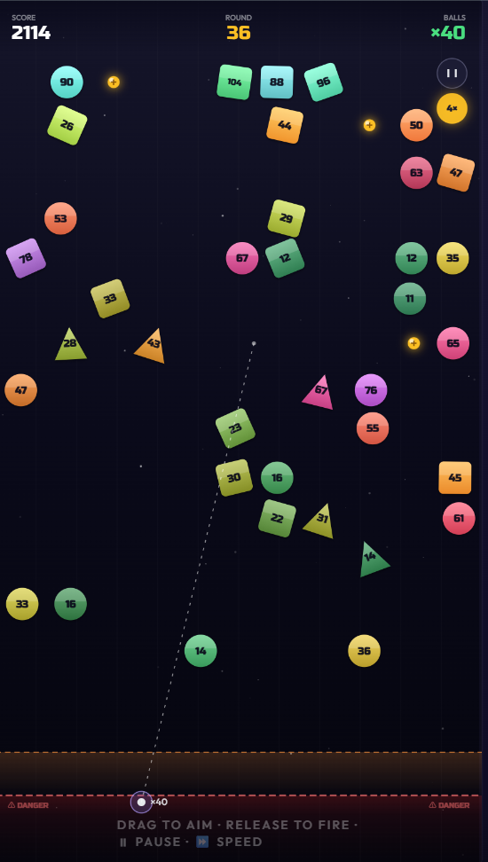
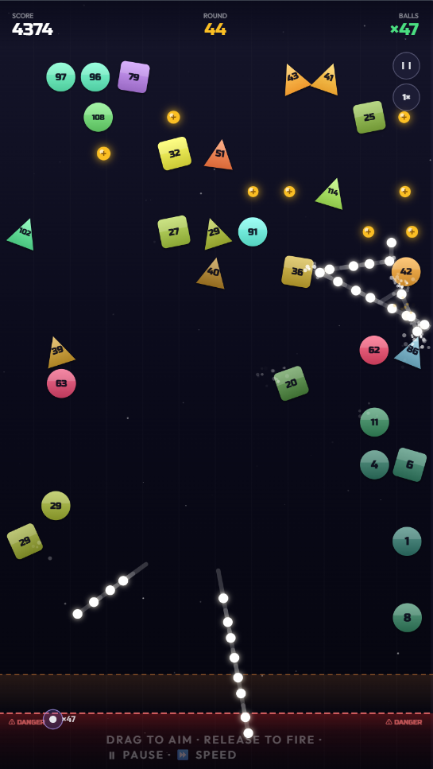
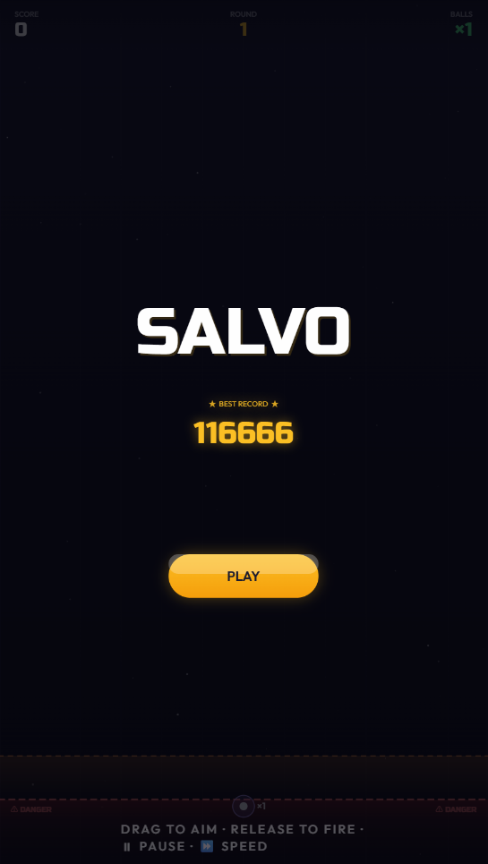
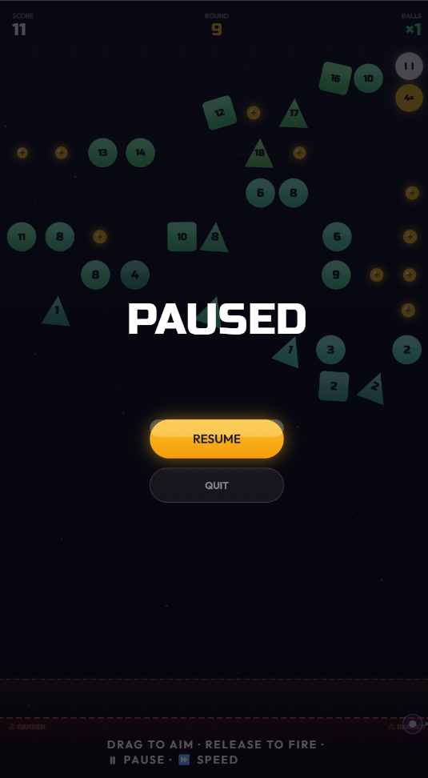
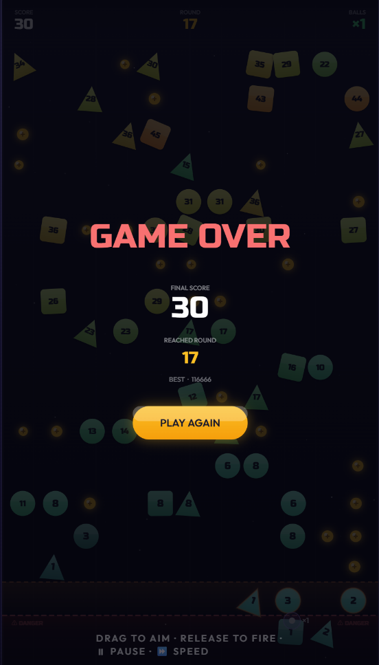

# 🎯 Salvo I: Origin

[简体中文](./README.zh-CN.md) | **English**

> 🧱 A pure front-end physics-based brick-breaker. 🎯 Aim, 🔥 fire, and let a swarm of ⚽ balls ricochet between walls and bricks to clear as many numbered blocks as you can — while stopping them from reaching the bottom 🚨 danger line.

     

---

## 💡 What is this

Salvo is a 🎮 BBTAN-style physics brick-breaker written in **vanilla HTML5 Canvas + JavaScript**, with **no build step, no dependencies, no frameworks**. 🪶 Open `index.html` to play — works on both 🖥️ desktop and 📱 mobile browsers.

### ✨ Key features

- 🌐 **Pure front-end**: a single HTML file + 14 JS modules, no bundling
- ⚙️ **Fixed-timestep physics**: behaves identically at 60 FPS / 144 FPS
- 🔷 **Multiple brick shapes**: square / triangle / circle, some with random rotation
- 🚀 **Variable speed**: switch between 1× / 2× / 4× / 8× during simulation
- 🏆 **Local high score**: persisted via `localStorage`

---

## 🎮 How to play

### 🎯 Goal

Each round: **clear as many numbered blocks as you can without letting any block reach the bottom danger line** ☠️.

### 🔁 Round flow

1. 🎯 **Aim**: press and drag — a dashed trajectory line appears, including one wall reflection prediction.
2. 🔥 **Fire**: on release, all balls launch sequentially at 40 ms intervals, forming a stream.
3. 💥 **Bounce**: balls ricochet between walls and bricks. Each hit reduces a brick's HP by 1; when HP reaches zero the brick is destroyed.
4. 🪂 **Recover**: balls disappear when they hit the floor. **The position of the first landed ball** determines the launch point for the next round.
5. ⬇️ **Resolve**: once all balls have landed, every brick shifts down one row and a new row spawns at the top.
6. 💀 **Fail**: the game ends when any brick's visual bottom edge crosses the red 🚨 DANGER line.

### 🧩 Key mechanics

- 🔢 **Brick HP**: the number on a brick is its current HP; higher HP means a darker color. Newly spawned bricks scale HP with the round number.
- 🌟 **Bonus balls**: golden balls appear on the field. Collect one to gain +1 ball next round; multiple bonuses stack.
- ⚠️ **Warning zone**: bricks below the orange dashed line that **will cross the line next round** glow with an orange outline — a "destroy-or-die" warning.
- 🟥 **Danger line**: the area beneath the red DANGER line; any brick crossing it ends the game.
- 📈 **Score**: +1 per point of damage dealt to a brick.

### 🧢 Ball cap system (BBTan standard)

To prevent late-game ball-count growth from overflowing the object pool (`acquireBall` returning `null` → `ballsActive` miscount → round never ends → soft-lock), the game caps ball count once it reaches `BALL_CAP`:

- 🧢 **Ball cap**: once `ballCount` reaches `BALL_CAP` (= `POOL_SIZE` = 220) it no longer increases.
- 💰 **Overflow → score**: bonuses collected after the cap convert to score at `OVERFLOW_SCORE` (300 pts each) — no reward is wasted.
- 📉 **HP slope decay**: from the first capped round, new bricks' HP growth slope drops from `3×round` to `3×0.3×round` (`HP_SLOPE_POST_CAP = 0.3`). The formula stays continuous at the cap boundary; the difficulty curve flattens so progress depends on skill, not ball-count stacking.
- 🛡️ **Defensive guard**: `launchOne` checks `acquireBall`'s return value and skips the `ballsActive++` on `null`, so any future regression still can't deadlock the round.

> 🎛️ All four constants live in `js/config.js` — tweak the cap threshold, overflow score rate, and HP decay slope to taste.

---

## 🕹️ Controls

| Action | Mouse 🖱️ | Touch 📱 |
| --- | --- | --- |
| 🎯 Aim | Press & drag | Press & drag |
| 🔥 Fire | Release | Release |
| ⏸ Pause / Resume | ⏸ button (top-right) | same |
| 🚀 Cycle speed (1→2→4→8→1) | ⏩ button (top-right) | same |

> 📐 Aim angle is clamped to 10° – 170° to avoid horizontal shots.

---

## 📸 Gallery

Click any screenshot to view full size.

<table>
  <tr>
    <td align="center"><a href="screenshots/gameplay-01.png"></a></td>
    <td align="center"><a href="screenshots/gameplay-02.png"></a></td>
    <td align="center"><a href="screenshots/gameplay-03.png"></a></td>
  </tr>
  <tr>
    <td align="center"><a href="screenshots/gameplay-04.png"></a></td>
    <td align="center"><a href="screenshots/gameplay-05.png"></a></td>
    <td></td>
  </tr>
</table>

---

## 🚀 Run

No build required. Pick one:

```bash
# Option 1: just open index.html

# Option 2: local static server (recommended for mobile testing)
python -m http.server 8000
#   open http://localhost:8000

# or
npx serve .
```

✅ Works on any modern browser with Canvas, `requestAnimationFrame`, and `localStorage` — including iOS Safari, Chrome Android, and desktop Chrome / Firefox / Safari / Edge.

---

## 📂 Project structure

```
Salvo/
├── index.html              # entry: HTML + inline styles + script load order
├── README.md               # English docs
├── README.zh-CN.md         # Simplified Chinese docs
└── js/
    ├── config.js           # all tunable constants and state enum
    ├── canvas.js           # canvas/ctx acquisition + high-DPI setup
    ├── utils.js            # color, rounded rect, clamp helpers
    ├── audio.js            # WebAudio synthesized sound effects
    ├── game-state.js       # global mutable state + localStorage best score
    ├── ball-manager.js     # ball object pool: acquire / release
    ├── brick-manager.js    # brick spawn, row shift, spatial hash, fail check
    ├── collision.js        # circle vs rectangle collision
    ├── physics.js          # single-step physics: wall / brick / bonus collisions
    ├── particles.js        # hit particle effects
    ├── game-flow.js        # start game / round resolve / speed cycling
    ├── input.js            # mouse / touch input, aim trajectory prediction
    ├── renderer.js         # canvas drawing (background, bricks, balls, HUD, menus)
    └── main.js             # main loop frame()
```

🎛️ All tunable parameters live in `js/config.js` — tweak the values to change difficulty, pacing, and visual style.

---

## 📄 License

🪪 MIT
